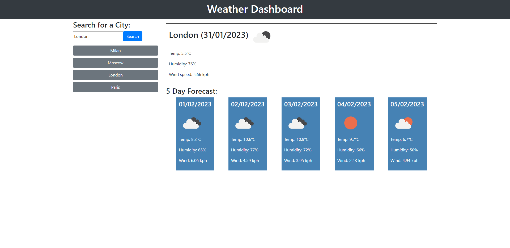

# Weather Dashboard

## Description
Search for any city and this weather dashboard will display the current weather and the forecast for the next five days. The application will also save your previous searches as buttons which, when clicked on, will display the forecast for that city again. 

[Click here](https://codenamehaylz.github.io/Weather-Dashboard/) to view the deployed application.

## Features
This application was built using the Open Weather Map API, jQuery and Moment.js.
It uses local storage to save the user's previous searches, and removes any duplicate searches.

## License
MIT License.